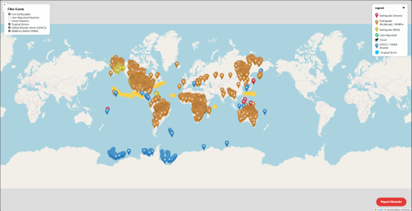

# Crisis-Tracking-Tool: Real-Time Disaster Monitoring via Open Data and Interactive Mapping

A web-based real-time disaster alert mapping tool built with HTML, CSS, and JavaScript using **Leaflet.js**.  
Fetches live earthquake data from the **USGS GeoJSON feed** and displays it on an interactive **OpenStreetMap-based map** with full-screen view, dynamic popups, and automatic updates.

---

## Inspiration

Inspired by **Google Crisis Response** and **NASA hackathon challenges**.  
The aim was to create something **socially impactful** that could help communities visualise and respond to disaster data quickly — while also looking visually impressive in screenshots and demos.

---

## Features

- **Live Data Integration** – Real-time USGS earthquake data feed
- **Interactive Map** – Built with Leaflet.js and OpenStreetMap tiles
- **Detailed Popups** – Magnitude, location, and event time for each earthquake
- **Auto-Refresh** – Map updates automatically to show the latest events
- **Full-Screen Mode** – Immersive disaster monitoring experience
- **Easy to Run Locally** – No server setup required

---

## Prerequisites

* Web browser (Chrome, Firefox, or Edge recommended)  
* [Visual Studio Code](https://code.visualstudio.com/)  
* [Live Server extension](https://marketplace.visualstudio.com/items?itemName=ritwickdey.LiveServer) for local testing

---

## Installation

```bash
# Clone the repository
git clone https://github.com/yourusername/Real-Time-Disaster-Alert-Map-Tool.git

# Navigate into the project folder
cd Real-Time-Disaster-Alert-Map-Tool
```

---

## Usage
This project runs locally in a browser using the Live Server extension in VS Code.

Steps to Run:
* Open the folder in Visual Studio Code
* Right-click index.html → "Open with Live Server"
* The map will launch in your browser and start displaying live earthquake alerts
### Map Interaction:
| Action         | Result                                                               |
| -------------- | -------------------------------------------------------------------- |
| Click marker   | Opens popup with earthquake details (magnitude, location, timestamp) |
| Scroll / pinch | Zoom in or out on the map                                            |
| Drag map       | Move view to different regions                                       |

---

## License

Including a LICENSE file clarifies how others may use, modify, and distribute your code. By choosing an open-source license such as MIT, you grant permission for use under defined terms while protecting your intellectual property and limiting liability.

This project is licensed under the MIT License. See [LICENSE](LICENSE) for full details.


---

## Project Structure

```plaintext
Crisis-Tracking-Tool/
│── index.html         # Main HTML file
│── style.css          # Styles for map and UI
│── script.js          # Core JavaScript logic
│── assets/            # Images, icons, and related media
└── README.md          # Project documentation
```

---

## ScreenShots

### Main Map View  


---

## Roadmap
* Add filtering by magnitude or time range
* Implement offline caching for unstable connections
* Add heatmap and clustering features for better visualisation
* Deploy as a hosted public web app

---

## Author

* **Daniel Cullinane** – [daniel.cullinane@outlook.com](mailto:daniel.cullinane@outlook.com)
* GitHub: [@dancull](https://github.com/dancull)

## Hackathon Context
Developed as part of a hackathon project inspired by Google Crisis Response and NASA hackathon challenges, aiming to make disaster data accessible, actionable, and visually compelling.
